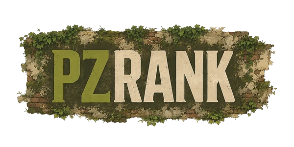

<p align="center">
  
</p>

<h1 align="center">PZ Rank</h1>

<p align="center">
  Site oficial de ranking para o desafio de sobrevivência da comunidade <strong>Brasileirão PZ</strong>.<br/>
  Os jogadores enviam seus dados via mod Lua e o sistema processa, pontua e exibe em tempo real.
</p>

<p align="center">
  🌐 <strong><a href="https://www.pzrank.com.br">pzrank.com.br</a></strong>
</p>

---

## Stack

| Camada | Tecnologia |
|---|---|
| Frontend | React 18 + TypeScript + Vite 5 |
| Backend | Express 4 + TypeScript (Node.js) |
| Banco | PostgreSQL (produção) / SQLite (local) |
| Infra | VPS Ubuntu — Nginx + PM2 |
| i18n | i18next (PT / EN / ES / FR) |

---

## Arquitetura

```
pz-rank/
├── frontend/          # SPA React — servida pelo Nginx
│   ├── src/
│   │   ├── pages/     # Rotas (lazy-loaded)
│   │   ├── components/
│   │   ├── hooks/
│   │   └── lib/       # api, scoring, decoder, i18n…
│   ├── assets/        # Imagens (WebP), fontes
│   └── css/style.css  # Todos os estilos (CSS custom properties)
│
└── backend/           # API REST + SSE — servida pelo PM2
    └── src/
        ├── routes/    # auth, entries, players, sse, sync…
        ├── lib/       # decoder, scoring, sse (broadcast)
        └── db/        # sqlite-adapter (espelha interface Supabase JS)
```

### Fluxo de dados

```
Mod Lua (in-game)
    └─► POST /sync          # envia código PZR base64
            └─► decoder.ts  # decodifica campos
            └─► scoring.ts  # calcula score
            └─► broadcast() # SSE → todos os browsers conectados
                    └─► RankPage atualiza em tempo real
```

---

## Funcionalidades

- **Ranking em tempo real** via Server-Sent Events (SSE) com buffer e replay automático
- **4 abas:** Rank (vivos), Recordes, Mortos, Desqualificados
- **Busca global** por jogador ou personagem (sem resetar paginação)
- **Perfil do jogador** com histórico, habilidades e objetivos
- **Painel de moderação** com aprovação de pending e gestão de moderadores
- **Live status** integrado com Twitch e YouTube
- **Overlay para stream** (`/overlay/:id`) — layout minimalista sem UI
- **Sistema de temporadas** com contagem de dias e estatísticas da comunidade
- **i18n completo** em 4 idiomas (PT, EN, ES, FR)
- **Desqualificação** por mods não permitidos, debug, sandbox inválido
- **Paginação inteligente** — reseta só em ações do usuário, não em updates SSE

---

## Desenvolvimento local

### Pré-requisitos

- Node.js 20+
- Git

### Backend

```bash
cd backend
cp .env.example .env.local   # preencha JWT_SECRET
npm install
npm run dev:local             # SQLite local, porta 3000
```

### Frontend

```bash
cd frontend
cp .env.example .env.local   # VITE_API_URL=http://localhost:3000
npm install
npm run dev                   # Vite dev server, porta 5173
```

---

## Deploy (VPS)

A infra roda em VPS Ubuntu com Nginx + PM2. O fluxo de deploy é:

```bash
# 1. Merge/push para main
git push origin main

# 2. No VPS — pull e build do frontend
ssh root@<vps-ip>
cd /var/www/pzrank
git pull origin main
cd frontend && npm install --include=dev && npx vite build --outDir dist

# 3. Backend (se houve mudanças)
cd ../backend && npm install && npm run build
pm2 restart pzrank-api

# 4. Verificar
pm2 status
curl -I https://www.pzrank.com.br
```

### Serviços em produção

| Serviço | Comando |
|---|---|
| Backend API | `pm2 start dist/index.js --name pzrank-api` (porta 3000) |
| Frontend | Nginx serve `/var/www/pzrank/frontend/dist` |
| SSL | Let's Encrypt (certbot) |

### Nginx — pontos importantes

- `index.html` → `Cache-Control: no-cache` (garante que novos deploys sejam carregados)
- Assets JS/CSS com hash → `Cache-Control: public, immutable` (1 ano)
- `/sse` → `proxy_buffering off`, `proxy_read_timeout 3600s`
- Gzip habilitado: JS −65%, CSS −84%

### PM2 — modo fork obrigatório

O SSE usa um singleton em memória (`Map` de clientes). PM2 deve rodar em **fork mode** (não cluster), pois cluster dividiria os clientes SSE entre workers sem comunicação entre eles.

---

## Comandos úteis

```bash
# Frontend
npm run build   # tsc --noEmit + vite build
npm run test    # vitest run

# Backend
npm run build   # tsc → dist/
npm run test    # vitest run

# PM2
pm2 logs pzrank-api --lines 50
pm2 status
```

---

## Mod Lua

O companion mod que roda in-game e envia dados para a API está disponível na Steam Workshop.  
Veja a página de [links e downloads](https://www.pzrank.com.br/links) para instruções de instalação.

---

## Licença

Software proprietário — todos os direitos reservados.

Copyright (c) 2026 Lucas Buneo de Camargo / PZ Community.

O código-fonte pode estar visível para fins de transparência, mas visibilidade pública não concede permissão para copiar, modificar, distribuir ou criar obras derivadas.

Veja [LICENSE](LICENSE) para os termos completos.

| Documento | Descrição |
|---|---|
| [LICENSE](LICENSE) | PZ Community Proprietary License v1.0 |
| [TERMS_OF_USE.md](TERMS_OF_USE.md) | Termos de uso |
| [PRIVACY.md](PRIVACY.md) | Política de privacidade |
| [COMPETITION_TERMS.md](COMPETITION_TERMS.md) | Regulamento do Brasileirão PZ |
